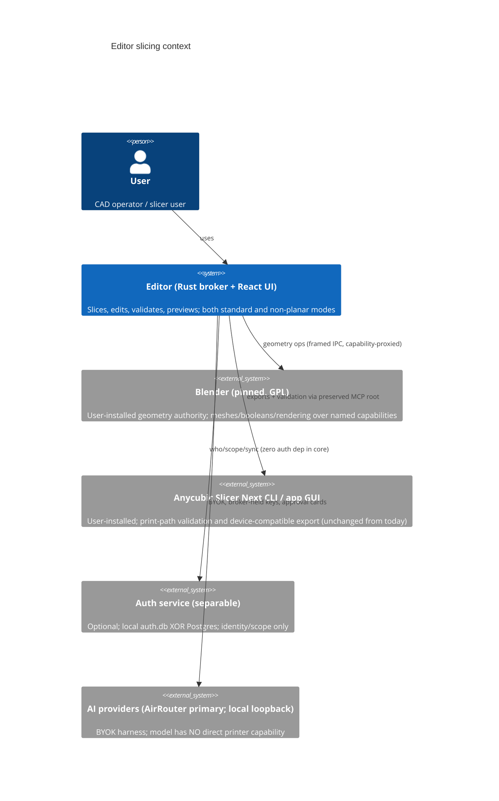
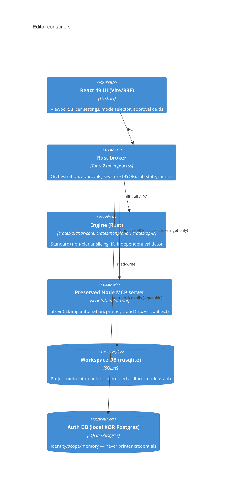

# Editor Architecture — Target Design for the React/Tauri Slicer

> **Sprint 5 / S5-001.** Converts the research in
> [custom-slicer-editor-investigation-2026-09-27.md](research/custom-slicer-editor-investigation-2026-09-27.md)
> Rev 2.0 into a committed, implementable design. This file is the canonical
> architecture for the NEW editor workspace (`apps/editor` + `crates/`). The
> preserved repo root (MCP server, scripts, schemas, vendor) is documented in
> [`architecture.md`](architecture.md) and stays untouched.

Every decision cites its investigation section. Every dependency row is annotated
with license + direct-vs-reference classification per [`licenses.md`](licenses.md)
and the binding §🔒 LICENSE POLICY.

---

## 1. Context

The product is a local-first slicer/editor for Anycubic printers that must offer
**both slicing modes as first-class** (§3.0a, user-confirmed 2026-09-28):

- **standard** (planar) — default, always available, product-grade at R2;
- **non-planar** — opt-in per project, capability-gated (continuous-Z + slope
  budget + joint model), never a silent fallback.

The engine is **own code** (Rust), with **Blender** as an external geometry
**authority** (user-installed prerequisite, never bundled) and the **preserved
repo root** as the MCP/automation partner (drive the installed Anycubic Slicer
Next CLI and app GUI exactly as today).

### Actors (C4: System Context)



### Containers (C4: Container)



---

## 2. Process model & boundaries

| Decision                | Design                                                                                                                                                                                  | Source |
| ----------------------- | --------------------------------------------------------------------------------------------------------------------------------------------------------------------------------------- | ------ |
| Process model           | React/Vite UI → (Tauri IPC) → **Rust broker** (owns secrets/approvals) → engine crates (in-process lib) + **Blender T2 worker** (separate process) + optional OCCT conversion-only tier | §4     |
| One-Blender-per-process | A single external Blender process is pinned (user-installed) and communicates over a **framed stdio/IPC** contract; never a raw handle into the UI                                      | §4.6   |
| Broker keystore         | BYOK keys live in the broker keystore (DPAPI/Stronghold), **never** in SQLite; auth tenant ≠ printer creds                                                                              | §5, §6 |
| Auth separability       | Editor core compiles **zero auth dependency**; auth is a separate service (local auth.db XOR Postgres, build-time flag)                                                                 | §6     |
| Retired boundary        | `ui/cad.html` + legacy in-memory scene = **frozen/read-only**; preserved MCP contract (`schemas/tools.json` names/schemas) untouchable                                                  | §2     |

### Dependency directions (enforced by `scripts/check-architecture.mjs`)

```
UI ──► broker ──► engine          (no UI→DB, no tool→secret)
broker ──► keystore (BYOK)        (secrets only reachable here)
broker ──► preserved MCP root     (loopback, session token, get-only for state)
engine ──► capability names       (DIP: tools depend on capability names, not modules)
```

### Framed stdio / IPC command contract (§4.6)

- **Transport**: framed stdio IPC (length-prefixed JSON commands) for the
  Blender worker; Tauri IPC for UI→broker.
- **Artifacts**: binary geometry/thumbnails flow over a **dedicated binary
  channel** (not in the JSON envelope).
- **Stale revision**: every command carries a revision; a worker responding to a
  stale revision is rejected and the UI is told to re-sync.

### Machine capability contract — single source of truth (§5.1)

- Schema: JSONC v1.0 with declared capabilities: `continuous_z.supported`,
  slope budgets, `tool_envelope`, joint model, dialect whitelist.
- Ingestion: 3 read-only paths; unknown field ⇒ `null` ⇒ fail-closed pre-flight.
- Revocation: event-driven; a revoked profile never runs.
- Bundled reference profile: **placeholders only** (`<MACHINE_TYPE>`,
  `<PRINTER_ID>`, `<FW_VERSION>` …) per AGENTS.md.

---

## 3. Module layout (workspace)

```
apps/editor/          Tauri 2 + React 19 (TS strict) — UI, IPC client
crates/broker/        Rust broker — orchestration, approvals, keystore, job state
crates/engine/        Rust engine — planar core, slicing modes, op IR, validator
crates/nonplanar/     S2 height-field / S3 conformal (capability-gated)
crates/ipc/           framed stdio contract types (shared)
preserved root        scripts/ vendor/ schemas/ presets/ tests/ tools/ — untouched
```

### Code-quality levels (health gate — every sprint)

1. `format:check` (prettier)
2. `lint` (eslint flat, typescript-eslint)
3. `typecheck` (`tsc --noEmit`, strict)
4. `test:unit` (node --test, `tests/*.test.mjs` ≥ 191)
5. `test:integration` (`tests/integration/*.test.mjs`)
6. `build` (esbuild artifact gate)
7. `smoke` (MCP contract, ≥ 79 tools)
8. `test:e2e` (legacy UI headless)
9. `check:licenses` (§🔒 policy)
10. `check:architecture` (SOLID/DRY)
11. sanitizer dry-run (0 files / 0 groups)

---

## 4. SOLID & DRY doctrine (summary)

- **SRP**: engine modules pure; MCP tool adapters thin; broker = orchestration +
  approvals; planner kernels own.
- **OCP**: extension via registries (capability registry, tool registry,
  slicing-mode registry) — no switch spam in engine.
- **ISP**: harness tiers T0/T1/T2/T3a/T3b have separate surfaces; nothing higher
  can touch a lower tier's internals.
- **DIP**: broker owns secrets; tools depend on capability **names**; engine
  never imports UI or DB.
- **DRY**: shared zod schemas in `schemas/`; import, don't duplicate.
  `// DESIGN: duplicated on purpose` is **banned** (enforced).

Full text: [`solid-dry-rules.md`](solid-dry-rules.md) (planned, Sprint 5/6).

---

## 5. Retirement & preservation

| Area                                                                                                              | Status                                                                                 |
| ----------------------------------------------------------------------------------------------------------------- | -------------------------------------------------------------------------------------- |
| `ui/cad.html` + legacy in-memory scene                                                                            | Frozen/read-only (legacy MI path)                                                      |
| `scripts/*`, `vendor/server.mjs`, `schemas/tools.json`, `schemas/openapi.json`, `presets/catalog.json`, `tests/*` | **Preserved** — new editor consumes them as-is (MCP stdio / read-only), never forks    |
| Boundary test                                                                                                     | `tests/boundary-tools.test.mjs` — tools.json stays superset-compatible with smoke list |
