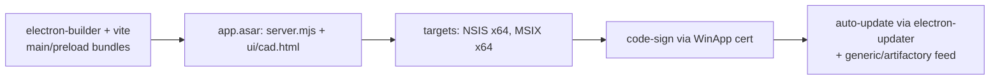

# S4-002 — Electron Packaging Blueprint (electron-builder)

> **Sprint**: 4 (docs-only) · **Status**: ⏳ Planned → ✅ Documented
> **Companion docs**: `docs/adr-electron-shell.md` (ADR-001), `docs/electron-security-local-only.md`

This blueprint describes how to package `anycubic-slicer-next-control` (Node ≥22 + MIT
licenses) as an Electron desktop app when the "future Electron" phase arrives. It is a
**checklist + config sketch**, not runnable code.

## 1. High-level flow



## 2. Project layout sketch (future)

```
electron/
  main/
    index.cjs          # main process: supervision + token bridge
    preload.cjs        # contextBridge: window.cadToken, window.cad.*
  renderer/            # symlink/copy of ui/cad.html assets at build time
    index.html
  vendor/              # offline copies of three@0.186.0, three-mesh-bvh, three-bvh-csg
```

The **server stays at `dist/server.mjs`** — packaging only decides how it is bundled:
as an extra `asar` entry executed by `node` embedded in the Electron runtime (Option A in
ADR-001: child process). For MSIX, Electron uses its own runtime; the Node runtime the
server needs is **embedded** per the runtime-requirement note below.

## 3. electron-builder config sketch

```yaml
appId: com.anycubicbridge.cad
productName: Anycubic Bridge CAD
directories:
  output: release/
  buildResources: build/
files:
  - dist/server.mjs
  - ui/**/*
  - electron/main/**/*
  - electron/vendor/**/*
asar: true
extraMetadata:
  main: electron/main/index.cjs
win:
  target:
    - target: nsis
      arch: [x64]
    - target: msix
      arch: [x64]
  executableName: anycubic-bridge-cad
nsis:
  oneClick: true
  perMachine: false
  deleteAppDataOnUninstall: false
msix:
  identityName: com.anycubicbridge.cad
  publisherDisplayName: Anycubic Bridge
  signatureSubjectName: CN=Anycubic Bridge
  signing:
    # WinApp CLI generated self-signed cert for dev; real OV/EV cert for prod
    certificateFile: certs/bridge-2026.pfx
    certificatePassword: env:CERT_PASSWORD
publish:
  provider: generic
  url: https://updates.example.org/bridge-cad/
electronLanguages: [en-US, pt-BR]
```

### 3.1 Runtime requirement note

- The CAD server needs **Node ≥22** (ESM + modern WASM). Electron ships its own V8 but
  **not** a full Node runtime usable as a child process.
- Recommended: embed the runtime inside the app (`extraResources` with a portable Node
  build) OR run the server **in-process** in the Electron main (Node ≥22 behavior via
  Electron's Node integration, which since Electron ~28 tracks recent Node majors).
- Decision rule: if upstream server continues to need _external_ Node ≥22 features, embed
  the portable runtime and spawn it (cleanest supervision). If Electron's embedded Node
  satisfies `node --check` on `dist/server.mjs` + WASM imports, favor in-process.

### 3.2 Offline UI dependencies (import-map vendoring)

`ui/cad.html` currently loads `three@0.186.0`, `three-mesh-bvh@0.9.15`,
`three-bvh-csg@0.0.18` from CDNs. Packaging must vendor these **locally** (all MIT — the
project's license constraint is preserved):

```
electron/vendor/
  three/three.module.min.js        # npm three@0.186.0
  three-mesh-bvh/...               # npm three-mesh-bvh@0.9.15
  three-bvh-csg/...                # npm three-bvh-csg@0.0.18
```

Update the import-map inside the shipped `index.html` to the `custom://app/vendor/...`
paths. `cadFetch` and all other logic stay unchanged.

## 4. App icon / manifest asset checklist

Per the WinApp CLI manifest/asset workflow (MIT-compatible tooling):

- [ ] `build/icon.ico` — 256×256 multi-resolution ICO (source: SVG → render at 16/24/32/48/64/128/256).
- [ ] `build/icon.png` — 512×512 for Linux/macOS future + MSIX logo.
- [ ] `build/icon.icns` — macOS future (optional this sprint).
- [ ] `build/splash.png` — optional on first-run.
- [ ] `build/entitlements.*` — n/a on Windows.
- [ ] App manifest fields (set once, reused by MSIX): `appId`, display name, publisher.
- [ ] If file association or protocol handler later: remember `executionAlias`,
      `fileTypeAssociations[].ext` in electron-builder `fileAssociations`.
- [ ] CI: generate assets from a single SVG via `sharp`/`pngjs`-based script (both MIT).

## 5. Signing certificate workflow

1. **Dev loop**: WinApp CLI `winapp cert generate` self-signed cert (dev-only, seed into
   `certs/` — **never commit passphrase**; store in env `CERT_PASSWORD`).
2. **Release**: acquire an OV/EV code-signing certificate from a CA (Comodo/Sectigo or
   Microsoft Store partner). EV adds Windows SmartScreen trust.
3. Sign order matters: **sign the app first** (`winapp sign`), then **MSIX package**
   (electron-builder `msix.signing`); do not sign after packaging.
4. Auto-update: `electron-updater` signs the latest.yml feed. Generic provider needs a
   static HTTPS host; MSIX Store apps update via Store channel instead.
5. **Never** put the `.pfx` or passphrase in the repo or in `latest.yml`.

## 6. Build matrix

| Target           | CI job                                      | Artifacts                                                         |
| ---------------- | ------------------------------------------- | ----------------------------------------------------------------- |
| Windows x64 NSIS | `windows` (GitHub Actions `windows-latest`) | `anycubic-bridge-cad Setup 0.1.0.exe`, `latest.yml`               |
| Windows x64 MSIX | same job, `electron-builder --win msix`     | `anycubic-bridge-cad_0.1.0_x64.msix`                              |
| Source / npm     | `npm pack`                                  | `anycubic-slicer-next-control-0.1.0.tgz` (server-only, unchanged) |

## 7. Clean-room / licensing checklist (MIT constraint)

- [ ] **No Anycubic proprietary assets** (icons, UI skins, G-code templates) bundled.
- [ ] All bundled JS/WASM deps carry MIT or Apache-2.0 licenses: `three` MIT,
      `three-mesh-bvh` MIT, `three-bvh-csg` MIT, `manifold-3d` Apache-2.0/MIT,
      `replicad` MIT, `replicad-opencascadejs` MIT.
- [ ] `electron` runtime itself is MIT (Chromium portions BSD-style).
- [ ] Include `THIRD_PARTY_NOTICES.md` generated from `pnpm licenses list` in the asar.
- [ ] Include the project `LICENSE` (MIT) + `THIRD_PARTY_NOTICES.md` in the installer.
- [ ] Redact any cloud credentials present in dev env from packaged artifacts
      (repackage must not ship `.env`, `.probe-*`, `AnycubicSlicerNextControl/tokens/*`).

## 8. Health gate (docs-only)

```bash
git diff --stat        # only docs/ + sprint-planning/ changes expected
```
