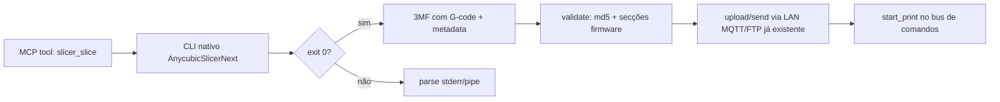

# Controle total do Anycubic Slicer Next via CLI/MCP — investigação 2026-09-14

> Resultado: **o AnycubicSlicerNext 2.0.0.3 instalado tem um CLI nativo completo que já
> produz o mesmo G-code/3MF que a GUI, sem UIA frágil e sem o erro 10115.** O que o
> CLI-Anything geraria para este app é, no essencial, um wrapper fino sobre este CLI.

## 1. Estado verificado no PC

- Executável: `C:\Program Files\AnycubicSlicerNext\AnycubicSlicerNext.exe` (v2.0.0.3)
- Processo ativo durante a investigação (janela "Vaso+Bello (Modo pessoal)")
- Presets locais: `resources\profiles\Anycubic\{machine,process,filament}\*.json`
  - Máquina Kobra S1 0.4mm: `Anycubic Kobra S1 0.4 nozzle.json`
  - Processo: `0.08mm Standard @Anycubic Kobra S1 0.4 nozzle.json`
- Python **não** está instalado no sistema → o gerador de harness do CLI-Anything
  (requer Python 3.10 + `pip install -e .`) não é utilizável nesta máquina sem instalar Python.

## 2. CLI nativo do slicer (a "anything CLI" já existente)

`AnycubicSlicerNext [OPTIONS] [file.3mf/file.stl ...]` — ajuda completa confirmada:

| Grupo                  | Flags                                                                                                                                                                                            | Uso para controlo programático                           |
| ---------------------- | ------------------------------------------------------------------------------------------------------------------------------------------------------------------------------------------------ | -------------------------------------------------------- |
| Accionar slicing       | `--slice <0\|i>`                                                                                                                                                                                 | `0` = todas as placas, `i` = placa `i`                   |
| Exportar projeto       | `--export-3mf <file.3mf>`                                                                                                                                                                        | Gera **3MF com G-code embutido** (o formato da firmware) |
| Exportar G-code direto | (implícito no `--export-3mf`)                                                                                                                                                                    | `Metadata/plate_<n>.gcode` no 3MF                        |
| Exportar settings      | `--export-settings <file.json>`                                                                                                                                                                  | Despeja a config completa como JSON                      |
| Load settings          | `--load-settings "a.json;b.json"` ; `--load-filaments` ; `--load-filament-ids "1,2"`                                                                                                             | Aplica presets de processo/máquina/filamento             |
| Output dir             | `--outputdir <dir>`                                                                                                                                                                              | Aplica ao G-code mas **NÃO** ao `--export-3mf` (ver 3.2) |
| Transformações         | `--scale <f>` ; `--rotate / --rotate-x / --rotate-y <deg>` ; `--matrix <float array>` ; `--repetitions <n>` ; `--clone-objects "1,3,1,10"` ; `--ensure-on-bed` ; `--arrange <0\|1>` ; `--orient` | Modelo-aware pré-fatiamento                              |
| Montagem/multi-bau     | `--assemble` ; `--load-assemble-list json` ; `--load-custom-gcodes json` ; `--paint-info json` ; `--load-filament-ids`                                                                           | Multiplaca / multi-material                              |
| Info                   | `--info`                                                                                                                                                                                         | Saída estruturada sobre o modelo                         |
| Progresso              | `--pipe <pipename>`                                                                                                                                                                              | Progresso de slicing para pipe (integração com agentes)  |
| Metadata               | `--metadata-name "n1;n2"` ; `--metadata-value "v1;v2"` ; `--makerlab-name` ; `--makerlab-version`                                                                                                | Carimbar metadados no 3MF                                |
| Outros                 | `--datadir` ; `--debug <0-5>` ; `--sanitize-3mf` ; `--no-check` ; `--normative-check` ; `--mtcpp` ; `--mstpp` ; `--uptodate` ; `--enable-timelapse`                                              | Operações auxiliares/recuperação                         |

Prioridade de settings: CLI > `--load-settings/--load_filaments` > ficheiro 3MF.

> Nota: o `export_gcode` action CLI puro foi comentado no ramo v2 da fonte, mas
> `--slice` escreve `plate_<n>.gcode` e `--export-3mf` empacota-o com metadata de
> firmware — o percurso de valor está 100% vivo, conforme comprovado a seguir.

## 3. Comprovação em HW local (PoC executado)

Comando usado (CWD = pasta de saída, presets Kobra S1 0.4mm):

```
AnycubicSlicerNext.exe --load-settings "<machine.json>" --load-settings "<process.json>" --slice 0 --export-3mf "cube-cli2.3mf" <cube-20mm.stl>
```

**Resultado (exit 0):**

- `plate_1.gcode` — 311 KB, 186 camadas
- `cube-cli2.3mf` — 40 KB, com:
  - `Metadata/plate_1.gcode` (304 KB), `plate_1.gcode.metadata`, `plate_1.gcode.md5`
  - `Metadata/plate_1.json`, `Metadata/project_settings.config` (26.8 KB),
    `Metadata/slice_info.config`, `Metadata/model_settings.config`
  - `3D/Objects/*.model` + `[Content_Types].xml`
- G-code com cabeçalho de firmware completo:
  `HEADER_BLOCK_START`, `source_info`, `paint_info`, `project_info`,
  `EXCLUDE_OBJECT_DEFINE`, `G9111 bedTemp=45 extruderTemp=200`, `M73 P0 R…`,
  `SET_VELOCITY_LIMIT`, larguras de extrusão — **o mesmo formato que a GUI produz.**

### 3.1 Consequência crítica

O motivo histórico pelo qual `slice_via_app` (GUI/UIA) era usado — o erro 10115 "CLI-sliced
file rejected" — **não se aplica a esta CLI**: os ficheiros saem do mesmo motor de fatiamento
`AnycubicSlicerNext 2.0.0.3` e incluem todas as secções que a firmware valida.

### 3.2 Bug conhecido do `--export-3mf` + `--outputdir`

Quando ambos são usados, o slicer **concatena o `outputdir` ao valor de `--export-3mf`
como se fosse relativo**, produzindo `outputdir/outputdir/archivo.3mf` (erro -13).
**Workaround verificado**: correr com `Push-Location <destino>` e usar `--export-3mf <nome>`
relativo (sem `--outputdir`), OU usar `--outputdir` sem `--export-3mf` e apanhar o
`output.gcode.3mf`/`plate_<n>.gcode` gerado. (A mesma observação vale para `--export-settings`.)

## 4. Onde entra o CLI-Anything (HKUDS/CLI-Anything)

- Repositório: 49.4k★, Apache-2.0, gerador de harnesses "torna qualquer software agent-native".
- **Não existe harness de slicer FDM no `registry.json`/CLI-Hub** (há `3mf`, `freecad`, `meerk40t`).
- Metodologia: 7 fases (analyze → design → implement → test → publish) gerando um pacote
  Python Click com REPL + `--json` — usável por agentes MCP/CLI.
- **Recomendação para este projeto**: NÃO gerar um harness genérico que reinvente o CLI.
  O valor real está em:
  1. Um wrapper fino (`orcaslicer_cli`) que normaliza o `--export-3mf` + `--outputdir`
     e expõe `slice`, `export-3mf`, `settings`, `info`, `transform` com saída JSON estável.
  2. Exposição como **tools MCP próprios** (deste repositório), com `confirm:` e validação
     do 3MF gerado (md5, secções de firmware), em vez de depender do plugin do CLI-Anything.
- O pipeline do CLI-Anything para "qualquer software com código-fonte" teria maior
  utilidade **se** quisermos um harness para o próprio OrcaSlicer upstream, mas aqui o
  alvo é um binário fechado com um CLI oficial — o wrapper direto é mais robusto.

## 5. Rota recomendada (controle ponta-a-ponta)



Próximas etapas concretas (proposta):

1. `scripts/slicer-cli.mjs` — invoca `AnycubicSlicerNext.exe` com CWD controlado,
   resolve presets Kobra S1, trata o bug `--export-3mf`/`--outputdir`, `--pipe` progress.
2. Tools MCP: `slicer_slice` (write, confirm) + `slicer_export_3mf` + `slicer_settings`
   (read) + `slicer_info` (read) — com o mesmo padrão `out()`/`fail()` e zod do resto.
3. Integrar com o pipeline existente (`printer-command-bus.mjs` para `start_print`,
   `printer-edge-tools.mjs` para validação do ficheiro exportado).
4. (Opcional, quando houver Python) um harness CLI-Anything `cli-anything-orcaslicer`
   para o CLI-Hub, gerado por cima do wrapper — para uso por agentes externos.

## 5.1 Implementação concluída (2026-09-15)

**Estado: COMPLETO** — as 4 tools MCP foram implementadas, testadas e validadas ao vivo.

| Ficheiro                                  | Papel                                                                                                                                                                                                                                        |
| ----------------------------------------- | -------------------------------------------------------------------------------------------------------------------------------------------------------------------------------------------------------------------------------------------- |
| `scripts/slicer-cli.mjs`                  | Wrapper fino do CLI nativo: `discoverSlicerExecutable`, `resolvePreset(s)`, `buildSliceArgs`, `runSlicer` (spawn + captura cap 64KB), `collectArtifacts`, `inspectCompatibility` (3MF: membros ZIP via EOCD/central dir; gcode: cabeçalhos). |
| `scripts/slicer-tools.mjs`                | `registerSlicerTools` — 4 tools MCP (`out()`/`fail()`/zod): `slicer_profiles` (read), `slicer_settings` (read), `slicer_slice` (write, gated `confirm:true`), `slicer_export_3mf` (alias gated).                                             |
| `vendor/server.mjs` + `scripts/build.mjs` | Wiring dinâmico `import("../scripts/slicer-tools.mjs")` após `registerEdgeTools`; build.mjs injeta a linha e asserta as tools.                                                                                                               |
| `tests/slicer-cli.test.mjs`               | 9 testes unit/E2E (discovery, resolução de presets, args, compat, collect, spawn, gating).                                                                                                                                                   |
| `scripts/smoke.mjs`                       | Tool list atualizada (92 tools); drive-check das 4 tools via handler.                                                                                                                                                                        |
| `schemas/tools.json`                      | Entradas dos 4 tools (86 total).                                                                                                                                                                                                             |

**Validação ao vivo (exit 0):**

- `slicer_profiles {"kind":"all"}` → 629 perfis (machine/process/filament).
- `slicer_settings` → JSON de settings exportado para `poc-output/cli-native/settings-tool.json`.
- `slicer_slice {"input_file":"tests/fixtures/cube-20mm.stl","confirm":true,...}` →
  `cube-mcp2.3mf` (39KB) com `Metadata/plate_1.gcode` → `compatible: true`
  (`has_sliced_gcode: true`).
- `slicer_export_3mf` → `output.gcode.3mf` (alias OK).
- Gate de segurança: `confirm:false` → `TOOL_ERROR: slicer_slice requires confirm: true`.

**Bugs corrigidos durante a implementação:**

1. `inspectCompatibility` usava `openSync()` fd com `.read()/.close()` → `readSync`/`closeSync`.
2. Offset do central directory ZIP: após split por `PK\x01\x02` o entry começa após a
   assinatura de 4 bytes → nome em `charCodeAt(24..29)`/`slice(42)` (não 28/46).
3. `machineType()` achatava a família e perdia o nozzle (`Kobra S1 0.4` → `kobra s1`)
   → pegava o primeiro ficheiro (0.25) → "process not compatible with printer" (exit -17).
4. Preset de processo default: o fallback alfabético pegava `0.06mm Standard @Kobra 3 Max`
   (incompatível com Kobra S1 0.4) → `presetFamilyFrom()` deriva o match do processo a
   partir do ficheiro de máquina efetivamente selecionado.

**Fluxo recomendado (agente):** `slicer_profiles` → `slicer_slice {confirm:true}` →
`send_to_printer` (3MF) → `start_print` (LAN) — sem UIA frágil.

## 6. Referências

- Fonte upstream (OrcaSlicer fork): `src/OrcaSlicer.hpp` — `class Slic3r::CLI { … run() }`
  e `src/libslic3r/PrintConfig.cpp` — defs `--slice`, `--export-3mf`, `--arrange`,
  `--load-settings`, `--outputdir` (commit `6103ed8`).
- CLI-Hub: `pip install cli-anything-hub` / `cli-hub list` (não há harness FDM hoje).
- `docs/research.md` §"Anycubic automation surface" (PoC CLI local original).
- PoC executado nesta investigação: `poc-output/cli-native/` (`cube-cli2.3mf`, `plate_1.gcode`).
